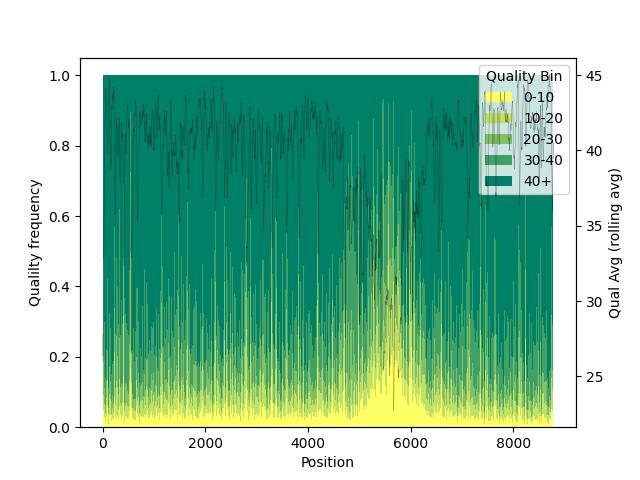
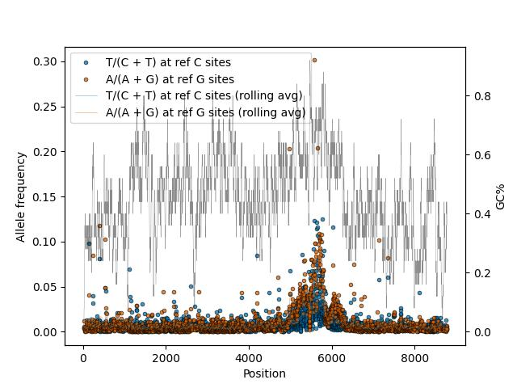
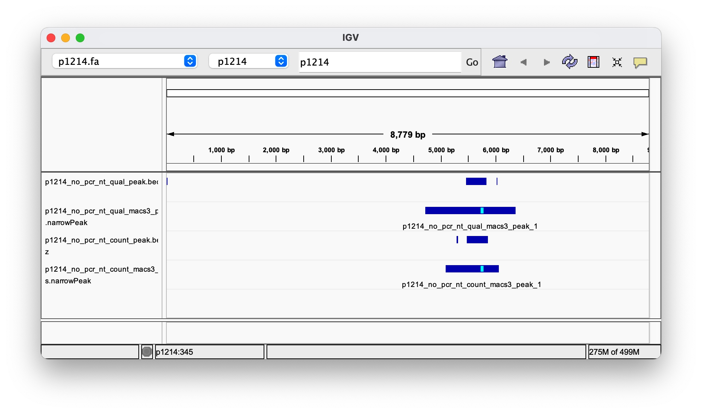

# nanoloop: Identify R-loops with Nanopore Reads

- [Introduction](#introduction)
- [Core Functions](#core-functions)
  - [bam_to_tsv](#bam_to_tsv)
  - [tsv_to_plot](#tsv_to_plot)
  - [tsv_to_bed](#tsv_to_bed)
  - [tsv_to_peak](#tsv_to_peak)
- [Installation](#installation)
- [Parameters](#parameters)
- [Examples](#examples)

## Introduction
The `nanoloop` library enables the identification of R-loop regions using nanopore sequencing data.

**R-loops** are three-stranded nucleic acid structures formed when nascent RNA hybridizes with its DNA template, displacing the non-template DNA strand. They play critical roles in transcription regulation, DNA replication, and repair. Dysregulated R-loops are associated with genomic instability and disease. 

In A3A-treated samples, unprotected single-stranded DNA in R-loops undergoes cytosine (C) deamination to uracil (dU). When using standard Dorado basecalling models, these dU sites are frequently **miscalled as C or T with lower basecalling quality**. `nanoloop` leverages this signature to

+ Quantify and visualize basecalling quality over specified genomic regions.

+ Quantify and visualize C-to-T conversion frequencies over specified genomic regions.

+ Simulate MACS3-compatible BED files for peak calling

+ Call R-loop peaks using a rolling average approach

## Core functions

### `bam_to_tsv`
Converts a BAM file to a bgzipped TSV file. The output reports per-position statistics: base count distribution (if `--type nt_count`) or base quality distribution (if `--type nt_qual`).

### `tsv_to_plot`
Generates plots from TSV files for a given genomic region:

+ `--type nt_qual`: uses TSVs from `nanoloop bam_to_tsv --type nt_qual` and generates plot depicting base quality distribution
+ `--type nt_count`: uses TSVs from `nanoloop bam_to_tsv --type nt_count` and generates plot depicting base count distribution

Note that when `--type nt_count`, the TSV input must be from `bam_to_tsv` with `--type nt_count`; and when `--type nt_qual`, the TSV input must be from `bam_to_tsv` with `--type nt_qual`.

### `tsv_to_bed`
Simulates a MACS3-compatible BED file:

+ `--type nt_qual`: uses TSVs from `nanoloop bam_to_tsv --type nt_qual`, lower average quality yields more tags
+ `--type nt_count`: uses TSVs from `nanoloop bam_to_tsv --type nt_count`, more tags where C-to-T conversion is higher

Note that when `--type nt_count`, the TSV input must be from `bam_to_tsv` with `--type nt_count`; and when `--type nt_qual`, the TSV input must be from `bam_to_tsv` with `--type nt_qual`.

### `tsv_to_peak`
Calls R-loop peaks using a rolling average approach. 

+ Supports both `--type nt_qual` and `--type nt_count`

Note that when `--type nt_count`, the TSV input must be from `bam_to_tsv` with `--type nt_count`; and when `--type nt_qual`, the TSV input must be from `bam_to_tsv` with `--type nt_qual`.

## Installation
```
pip install nanoloop
```

## Parameters
```bash
nanoloop -h
```
```
usage: nanoloop [-h] {bam_to_tsv,tsv_to_plot,tsv_to_bed,tsv_to_peak} ...

nanoloop

positional arguments:
  {bam_to_tsv,tsv_to_plot,tsv_to_bed,tsv_to_peak}
    bam_to_tsv          Parse BAM file and output TSV file
    tsv_to_plot         Parse TSV file and output plot
    tsv_to_bed          Convert TSV file to BED format for MACS3 peak calling. For "--type nt_qual": regions
                        with lower quality scores will generate more simulated read tags, creating peaks in
                        those regions. For "--type nt_count": the number of simulated read tags is proportional
                        to the fraction of C converted to T at each reference C position.
    tsv_to_peak         Call peaks using a sliding window approach

options:
  -h, --help            show this help message and exit
```

You can also run subcommand-specific help, e.g.`nanoloop bam_to_tsv -h`, etc.

## Examples
The following examples use the downsampled BAM `examples/bam/p1214_no_pcr.bam`, derived from an A3A-treated plasmid expected to contain R-loops around its middle region. "no_pcr" indicates sequencing was performed directly after A3A treatment (without PCR), preserving dU signatures.

### `--type nt_qual`: analyze base qualities

#### Step 1: generate TSV
```bash
nanoloop bam_to_tsv \
  --bam examples/bam/p1214_no_pcr.bam \
  --ref examples/ref/p1214.fa \
  --type nt_qual \
  --output examples/res/p1214_no_pcr_nt_qual.tsv.gz

zcat < examples/res/p1214_no_pcr_nt_qual.tsv.gz | head
```
```
#chr    start   end     ref_nt  qual_0_10       qual_10_20      qual_20_30      qual_30_40      qual_40_above   qual_avg
p1214   0       1       A       7       275     287     234     166     27.856553147574818
p1214   1       2       A       11      337     307     269     185     27.488728584310188
p1214   2       3       A       13      392     332     283     178     26.808848080133554
p1214   3       4       A       16      408     411     331     173     26.53846153846154
p1214   4       5       A       19      441     523     336     166     26.004040404040403
p1214   5       6       A       41      450     642     373     118     25.34975369458128
p1214   6       7       A       58      441     711     414     89      24.907180385288967
p1214   7       8       A       49      387     702     492     94      25.59570765661253
p1214   8       9       A       43      389     583     546     197     27.357792946530147
```

#### Step 2: visualize quality distribution
```bash
nanoloop tsv_to_plot \
  --tsv examples/res/p1214_no_pcr_nt_qual.tsv.gz \
  --type nt_qual \
  --range p1214:0-10000 \
  --add_qual_avg true \
  --output examples/res/p1214_no_pcr_nt_qual.jpg
```

Plot shows a base quality drop near 5000–6200, suggesting an R-loop



#### Step 3: call peaks
Use `nanoloop tsv_to_peak` to call peaks (potential R-loops) using a rolling average approach:
```bash
nanoloop tsv_to_peak \
  --tsv examples/res/p1214_no_pcr_nt_qual.tsv.gz \
  --type nt_qual \
  --output examples/res/p1214_no_pcr_nt_qual_peak.bed.gz
```

The resulting BED file successfully captures the potential R-loop regions:
```bash
zcat < examples/res/p1214_no_pcr_nt_qual_peak.bed.gz | head
```
```
p1214	0	24
p1214	5469	5830
p1214	6018	6035
```

Alternatively, we can convert the TSV file into a MACS3-compatible BED file for peak calling. In this approach:

  + For `--type nt_qual`: each position's average quality score is converted into simulated read tags, where lower quality scores generate more tags. This means regions with poor basecalling quality (potential R-loops) will have higher tag density.
  + For `--type nt_count`: each position's C-to-T conversion frequency is converted into simulated read tags, where higher conversion rates generate more tags. This means regions with more C-to-T conversions (potential R-loops) will have higher tag density.

Here's how to use this approach:

```bash
# Convert TSV to BED
nanoloop tsv_to_bed \
  --tsv examples/res/p1214_no_pcr_nt_qual.tsv.gz \
  --type nt_qual \
  --output examples/res/p1214_no_pcr_nt_qual.bed.gz

# Call peaks with MACS3
macs3 callpeak -f BED \
  -t examples/res/p1214_no_pcr_nt_qual.bed.gz \
  -n p1214_no_pcr_nt_qual_macs3 \
  -g 8779 \
  --keep-dup all \
  --nomodel \
  --extsize 200 \
  --outdir examples/res/p1214_no_pcr_nt_qual_macs3_peaks
```

Note that in the simulated BED file, each position becomes a read tag of length 1. The number of identical tags at each position reflects either:
- The inverse of the average quality score (for `--type nt_qual`)
- The C-to-T conversion frequency (for `--type nt_count`)

Therefore, we use `--keep-dup all` to preserve all tags and `--nomodel` to skip fragment length estimation, as our tags are already single-base signals. The results are consistent with the rolling average approach above:
```bash
cat examples/res/p1214_no_pcr_nt_qual_macs3_peaks/p1214_no_pcr_nt_qual_macs3_peaks.narrowPeak
```
```
p1214	4722	6364	p1214_no_pcr_nt_qual_macs3_peak_1	2414	.	1.57326	245.385	241.431	1044
```

### `--type nt_count`: Analyze C-to-T Conversion Frequencies

This approach focuses on the frequency of C-to-T conversions, which is another signature of R-loops in A3A-treated samples.

#### Step 1: generate TSV
```bash
nanoloop bam_to_tsv \
  --bam examples/bam/p1214_no_pcr.bam \
  --ref examples/ref/p1214.fa \
  --type nt_count \
  --output examples/res/p1214_no_pcr_nt_count.tsv.gz

zcat < examples/res/p1214_no_pcr_nt_count.tsv.gz | head
```
```
#chr    start   end     ref_nt  A       T       C       G       N
p1214   0       1       A       969     0       0       0       0
p1214   1       2       A       1109    0       0       0       0
p1214   2       3       A       1198    0       0       0       0
p1214   3       4       A       1339    0       0       0       0
p1214   4       5       A       1483    0       0       2       0
p1214   5       6       A       1620    0       0       4       0
p1214   6       7       A       1713    0       0       0       0
p1214   7       8       A       1722    0       1       1       0
p1214   8       9       A       1754    0       0       4       0
```

#### Step 2: visualize conversion frequencies
```bash
nanoloop tsv_to_plot \
  --tsv examples/res/p1214_no_pcr_nt_count.tsv.gz \
  --type nt_count \
  --range p1214:0-10000 \
  --add_gc true \
  --output examples/res/p1214_no_pcr_nt_count.jpg
```

The plot shows elevated C-to-T conversion frequencies around 5000-6200, indicating potential R-loop regions:



#### Step 3: call peaks
Use the rolling average approach to identify regions with significant C-to-T conversion:
```bash
nanoloop tsv_to_peak \
  --tsv examples/res/p1214_no_pcr_nt_count.tsv.gz \
  --type nt_count \
  --conversion_cutoff 0.03 \
  --output examples/res/p1214_no_pcr_nt_count_peak.bed.gz
```

The `--conversion_cutoff 0.03` threshold was determined from the visualization in Step 2. The resulting peaks capture the potential R-loop regions:
```bash
zcat < examples/res/p1214_no_pcr_nt_count_peak.bed.gz | head
```
```
p1214   0       24
p1214   5469    5830
p1214   6018    6035
```

Alternatively, we can use MACS3 for peak calling:
```bash
# Convert TSV to BED
nanoloop tsv_to_bed \
  --tsv examples/res/p1214_no_pcr_nt_count.tsv.gz \
  --type nt_count \
  --output examples/res/p1214_no_pcr_nt_count.bed.gz

# Call peaks with MACS3
macs3 callpeak -f BED \
  -t examples/res/p1214_no_pcr_nt_count.bed.gz \
  -n p1214_no_pcr_nt_count_macs3 \
  -g 8779 \
  --keep-dup all \
  --nomodel \
  --extsize 200 \
  --outdir examples/res/p1214_no_pcr_nt_count_macs3_peaks
```

The MACS3 results are consistent with the rolling average approach:
```bash
cat examples/res/p1214_no_pcr_nt_count_macs3_peaks/p1214_no_pcr_nt_count_macs3_peaks.narrowPeak
```
```
p1214   5093    6061    p1214_no_pcr_nt_count_macs3_peak_1      2187    .       11.9622 222.658 218.707 671
```

Below is an IGV snapshot comparing peaks called with different approaches:

